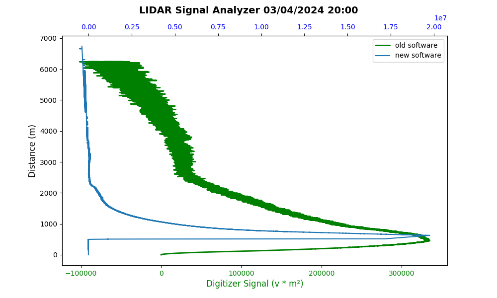

# LIDAR Signal Analyzer
The `LIDAR Signal Analyzer` script processes multiple CSV files containing time (`Time`) and signal amplitude (`Ampl`) measurements from LIDAR. It then computes `Distance` and `Digitizer Signal`, merges the data into a single combined dataset by taking a statistical measure (such as a median or mean) across all files, and finally plots the processed `Actual Data` alongside `Corrected Data` from a JSON file.

## Features

- Reads multiple CSV files from a specified folder.
- Ensures all CSV files have the same number of data rows.
- Calculates `Distance` and `Digitizer Signal` using the provided measurements.
- Aggregates data from all CSV files by taking a median (or mean) across rows to produce a single combined dataset.
- Filters `Actual Data` to only include `Distance >= 1000` and repositions it so that the smallest value in that range starts at 0 on the Y-axis.
- Compares the resulting `Actual Data` with `Corrected Data` provided in a JSON file.

## Equation and Calculations

1. **Distance Calculation**:  
   The distance is calculated from the time measurement using the Equation:
   ```
   Distance (m)= Time × c^2
   ```
   where \( c \) is the speed of light (approximately \( 3 \times 10^8 \; m/s \)).  
   The division by 2 is typically because the measured time corresponds to the round-trip travel time of the laser signal (out and back).

2. **Digitizer Signal Calculation**:  
   Once the distance is known, the `Digitizer Signal` is computed as:
   ```
   Digitizer Signal (v * m²) = Ampl × (Distance (m)^2)
   ```
   Here, `Ampl` is the amplitude of the returned signal voltage, and it's scaled by the square of the distance, which is a common approach in certain LIDAR analysis methodologies to account for signal attenuation over distance.

3. **Averaging Data (Merging Multiple Files)**:  
   When multiple CSV files are provided, each is read and pre-processed to ensure that:
   - They have the same number of rows.
   - They contain the required columns (`Time`, `Ampl`).
   
   The script then combines the data from all files row-wise. For each row index across all files, it applies a statistical function (such as median or mean) to aggregate the values. For example, using the median:
   ```
    combined_data = pd.concat(file_data).groupby(level=0).median()
   ```
   This approach produces a single representative dataset that smooths out noise and variations between measurements from different files.


## Input Data

1. **CSV Files**: CSV files must contain `Time` and `Ampl` columns. Files are read from the specified folder.  
   Example structure:
   ```
   Time,Ampl
   1.23e-5,0.002
   1.24e-5,0.003
   ...
   ```

   > Note: The script skips the first 4 rows (`skiprows=4`) when reading each CSV file.

2. **JSON File**: Contains corrected data (`OC_cal` and `dis`) for comparison.  
   Example structure:
   ```json
   [
     {
       "OC_cal": [value1, value2, ...],
       "dis": [distance1, distance2, ...]
     }
   ]
   ```

## Prerequisites

- Install Python 3.x.
- Install the required libraries:
  ```bash
  pip install pandas matplotlib tqdm
  ```

## Usage

1. Place the script and the JSON file in the `compla-code` folder (example structure below).
2. Create a folder containing multiple CSV files in the directory above `compl`, e.g.:
   ```
   project/
   ├─ csv-03-04-2024-tmp4-20-00/
   │  ├─ data1.csv
   │  ├─ data2.csv
   │  └─ ...
   ├─ compla-code/
   │  ├─ script.py
   │  ├─ ALiN_202404032035.json
   │  └─ ...
   ```
3. In the script (e.g., `gen-chart2-1.py`), set the `folder_path` variable to the target CSV folder, e.g., `folder_path = "../csv-03-04-2024-tmp4-20-00"`.
4. Run the script:
   ```bash
   python gen-chart2-1.py
   ```
5. The script will process the data and display a comparison graph showing `Actual Data` and `Corrected Data`.

## Example Output

- The graph will show `Actual Data` (blue) and `Corrected Data` (green).
- The `Actual Data` is filtered to only display distances greater than or equal to 1000 meters and is shifted to start from 0 on the Y-axis.

## Customization

- To modify filtering or data adjustment logic, edit the `plot_lidar_data` or `process_files` functions.
- To change the JSON file name or structure, update the `main()` function where `json_file_path` is defined.

---

## LIDAR Example

